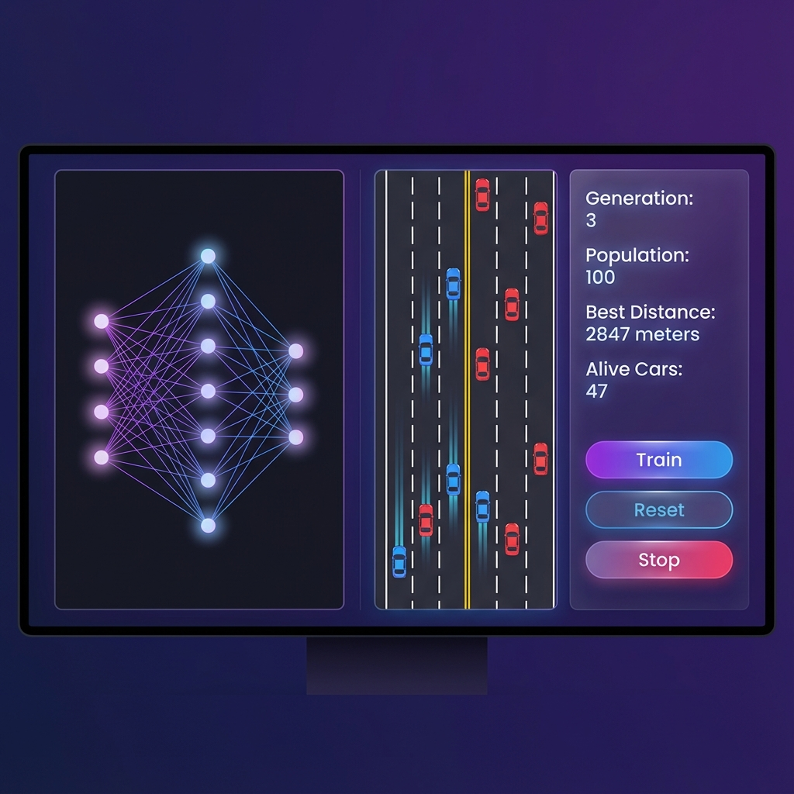

# Simulação de Carro Autônomo com JavaScript

Uma simulação de carro autônomo desenvolvida completamente do zero usando JavaScript puro, sem bibliotecas externas ou frameworks de Machine Learning.



## Demo ao Vivo

**Acesse a simulação rodando ao vivo:**  
[https://matheussiqueirahub.github.io/Self-Drive-Car/](https://matheussiqueirahub.github.io/Self-Drive-Car/)

## Visão Geral

Este projeto implementa um sistema completo de aprendizado por neuroevolução, onde 100 carros controlados por redes neurais aprendem simultaneamente a navegar por tráfego randomizado através de algoritmos genéticos.

## Características Principais

### Inteligência Artificial

- **Rede Neural Customizada**: Implementação manual sem bibliotecas ML
  - Arquitetura: 5 entradas → 6 neurônios ocultos → 4 saídas
  - Propagação feedforward com ativação tanh
  - Pesos e bias implementados manualmente
  
- **Algoritmo Genético**:
  - População de 100 agentes por geração
  - Seleção baseada em fitness multi-critério
  - Mutação gaussiana (taxa de 10%)
  - Persistência via localStorage

- **Função de Fitness Avançada**:
  - Recompensa por distância percorrida
  - Penalização por desvio de faixa
  - Penalização pesada por colisões
  - Incentivo para direção suave

### Sensores e Percepção

- **Ray-casting**: 5 sensores de distância
- **Detecção de colisão**: Baseada em polígonos
- **Leitura de ambiente**: Bordas da pista e tráfego
- **Visualização em tempo real**: Sensores visíveis durante operação

### Simulação de Tráfego

- **Geração dinâmica**: 50+ veículos com padrões randomizados
- **Velocidades variadas**: Entre 1.5 e 2.5 unidades
- **Posicionamento aleatório**: 3 faixas com distribuição não-determinística
- **Obstáculos complexos**: 30% de chance de "paredes" (carros lado a lado)

### Interface do Usuário

- **Design moderno**: Glassmorphismo com gradientes
- **Estatísticas em tempo real**:
  - Contador de geração
  - Tamanho da população
  - Melhor distância alcançada
  - Carros ativos (não colididos)
  
- **Controles**:
  - Salvar melhor rede neural
  - Resetar geração com mutações
  - Deletar progresso salvo

### Renderização Avançada

- **Carros detalhados**: 
  - Faróis amarelos
  - Lanternas traseiras vermelhas
  - Para-brisas translúcidos
  - Rodas visíveis
  - Rotação dinâmica baseada em ângulo
  
- **Pista realista**:
  - Divisórias de faixa douradas
  - Bordas brancas espessas
  - Estilo de rodovia profissional

- **Visualização da rede neural**:
  - Neurônios com ativação colorida
  - Conexões ponderadas
  - Atualização em tempo real

## Arquitetura do Código

```
├── index.html          # Estrutura HTML principal
├── style.css           # Estilização moderna da UI
├── main.js             # Loop de simulação e geração de tráfego
├── car.js              # Física do carro e renderização
├── network.js          # Implementação da rede neural
├── sensor.js           # Sensores ray-casting
├── road.js             # Renderização da pista
├── controls.js         # Gerenciamento de controles
├── utils.js            # Funções utilitárias
└── visualizer.js       # Visualização da rede neural
```

## Tecnologias Utilizadas

- **JavaScript ES6+**: Lógica principal
- **HTML5 Canvas API**: Renderização gráfica
- **CSS3**: Estilização moderna
- **LocalStorage**: Persistência de dados

Sem dependências externas, sem frameworks de ML, sem bibliotecas.

## Como Executar

1. Clone o repositório:
```bash
git clone https://github.com/matheussiqueirahub/Self-Drive-Car.git
```

2. Abra `index.html` em qualquer navegador moderno.

3. A simulação inicia automaticamente com 100 carros aprendendo.

## Fluxo de Aprendizado

### Geração Inicial
- Todos os carros possuem redes neurais com pesos aleatórios
- Maioria colide rapidamente
- Sistema identifica o melhor performer baseado em fitness

### Evolução
1. Usuário salva o melhor cérebro neural
2. Reseta a geração
3. Novos 100 carros recebem cópia do melhor cérebro com mutações
4. Cada geração melhora progressivamente

### Convergência
- Após múltiplas gerações, carros aprendem:
  - Manter-se centralizado na faixa
  - Evitar colisões com tráfego
  - Direção suave e estável
  - Navegação de longa distância

## Detalhes Técnicos

### Rede Neural

**Camada de Entrada** (5 neurônios):
- Leituras dos 5 sensores ray-casting
- Valores normalizados entre 0 e 1
- 0 = sem obstáculo, 1 = obstáculo próximo

**Camada Oculta** (6 neurônios):
- Ativação via função tangente hiperbólica
- Totalmente conectada com entrada e saída

**Camada de Saída** (4 neurônios):
- Controle binário: frente, ré, esquerda, direita
- Ativação determina ação do carro

### Física do Veículo

- **Aceleração**: 0.2 unidades/frame
- **Velocidade máxima**: 3 unidades
- **Fricção**: 0.05 (desaceleração natural)
- **Ângulo de rotação**: 0.03 radianos por input
- **Dimensões**: 30x50 pixels

### Algoritmo Genético

**Seleção**: Baseada em fitness (elitismo - melhor único preservado)

**Mutação**: 
- Taxa fixa de 10%
- Ruído gaussiano aplicado em pesos e bias
- Mantém diversidade genética

**População**: 100 agentes paralelos por geração

## Persistência

O melhor cérebro neural é salvo em `localStorage` do navegador. Isso significa:

- Não há modelo pré-treinado no repositório
- Ao clonar, você precisa treinar do zero
- O progresso é local por navegador/máquina
- Usar "Deletar Saved" reinicia completamente o aprendizado

## Melhorias Implementadas

Este projeto evoluiu significativamente do código original:

### Antes
- 1 carro único
- Tráfego estático e previsível
- Renderização básica com polígonos simples
- Interface minimalista
- Fitness baseado apenas em distância

### Depois
- 100 carros simultâneos (paralelização massiva)
- Tráfego dinâmico e randomizado
- Renderização detalhada com elementos visuais
- UI premium com glassmorphismo
- Fitness multi-critério (distância + disciplina de faixa + sobrevivência)

## Desempenho

- **FPS**: 60 (estável)
- **Carros simultâneos**: 100
- **Tráfego**: 50+ veículos
- **Otimização**: Canvas save/restore eficiente

## Inspiração

Baseado no curso "Self-Driving Car with JavaScript" disponível no YouTube, com extensivas modificações, melhorias e design customizado.

Vídeo original: https://youtu.be/Rs_rAxEsAvI

## Licença

MIT License - Livre para uso educacional e projetos pessoais.

---

Desenvolvido como demonstração de aprendizado profundo de conceitos de redes neurais, algoritmos genéticos e renderização em tempo real.
